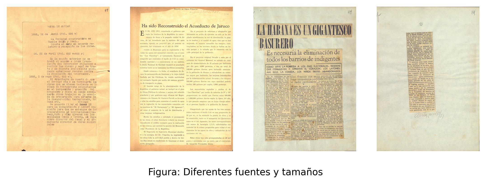
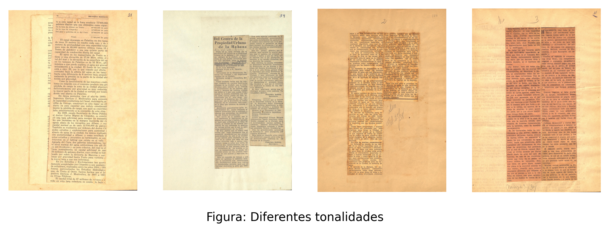
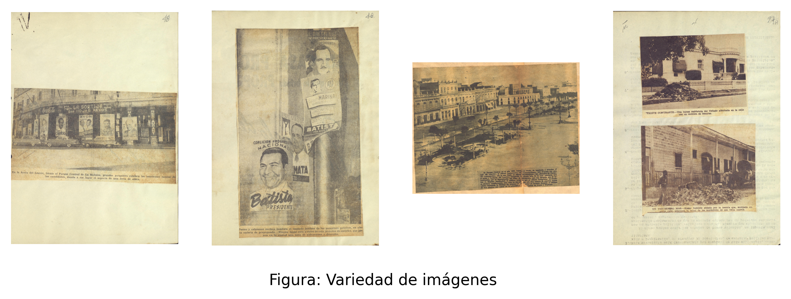
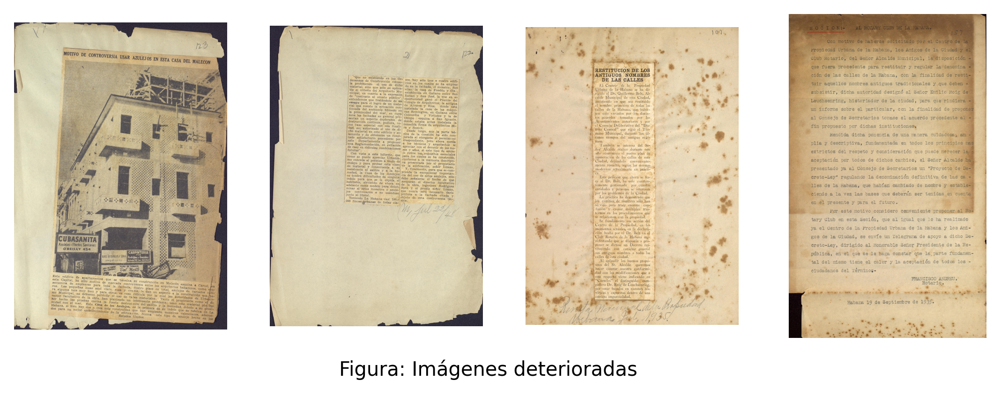
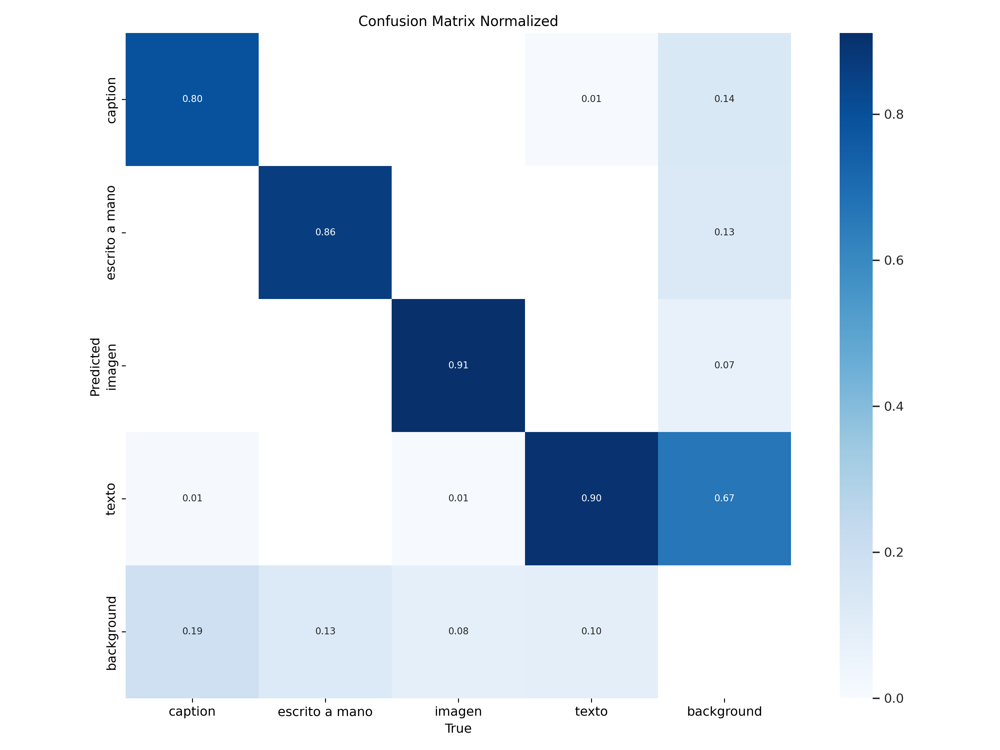
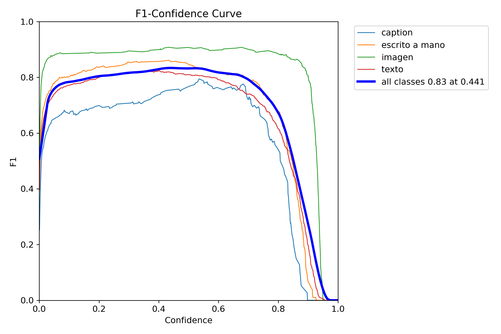

# CF-ERL — Emilio Roig de Leuchsenring's *Colección Facticia*

Machine-learning pipeline for digitising a historical archive: given a photograph of a page from a 1930s–50s Cuban document collection, it **locates** the images and text blocks on the page, **reads** the text, and **decides which caption belongs to which image**.

Built with the digitization department of the **Oficina del Historiador de La Habana** (Santo Domingo / San Gerónimo building) as the Machine Learning course project, Computer Science, University of Havana, 2024–2025.

> 🇪🇸 Full Spanish report — state of the art, every training curve, all references: [`README.es.md`](./README.es.md) · Written report: [`informeML.pdf`](./informeML.pdf)

---

## The problem

The *Colección Facticia* is the personal clipping-and-document archive of Emilio Roig de Leuchsenring, first Historian of Havana. It has been photographed but not structured: 220 folders, 30–400 photographs each, ~60 GB, [publicly available](https://repositoriodigital.ohc.cu/s/repositoriodigital/item-set/46268). The Oficina needs the *images* extracted as separate files, each paired with its description, so the collection becomes searchable.

Everything about the source material fights an off-the-shelf pipeline:

| | |
| --- | --- |
|  | **Layout is unconstrained.** Horizontal and vertical text on the same page, multiple typefaces, sizes, leading, and weights within one photograph. |
|  | **Paper tone varies** from white through yellow to reddish. Text is mostly typewritten but carries handwritten dates, signatures, marginalia, and strike-throughs. |
|  | **Images vary in kind and shape** — photographs, drawings, maps, charts — sometimes framed, sometimes irregular. |
|  | **The paper is damaged** — stains, folds, creases, wear — and photographs are often rotated. Recovering the *correct angle* is a hard requirement: the researcher shouldn't have to straighten anything by hand. |

Text is Spanish, occasionally with Latin-alphabet foreign words.

---

## Approach

The problem splits in two: **detect and extract**, then **associate**.

### 1. Detection — YOLOv11-OBB

Object detection with **YOLO11-nano in its oriented-bounding-box variant**. OBB is the reason for the choice: axis-aligned boxes cannot express a rotated page, but oriented boxes both satisfy the "correct angle" requirement and let text be de-rotated before it reaches the OCR. One model handles all classes in a single pass, and the nano size processes the collection at volume without a costly GPU.

Four labelled classes:

| Class | What it covers |
| --- | --- |
| `text` | Typewritten body text and headings, in the page's reading direction |
| `image` | Photographs, drawings, charts, maps |
| `handwritten` | Marginalia, signatures, dates, internal page numbers |
| `caption` | Titles, subtitles and photo captions — added specifically so images can be matched to their descriptions |

Captions are typically short, bold or italic, and adjacent to their image; their boxes are drawn to include a sliver of the image itself, which makes the geometric association step far more reliable.

**Training, in three rounds:**

| Round | Photographs | text / image / caption / handwritten | Result |
| --- | --- | --- | --- |
| 1 | 893 | 2903 / 341 / 223 / 980 | `image` strong; `caption` weak (few examples, many false positives); page-verso bleed-through misread as `text` |
| 2 — data augmentation | 1221 | 3492 / 794 / 483 / 981 | True positives up across every class; background-as-text errors largely gone |
| 3 — image preprocessing | 1221 | same | **Best model.** Precision and recall converge cleanly at high confidence, with the biggest gain on `text` |

Round 3 preprocesses with **greyscale + CLAHE** (contrast-limited adaptive histogram equalisation). Greyscale is a free win — color carries no class signal here and dropping it cuts dimensionality — and CLAHE flattens the illumination differences between photographs while sharpening text edges. Gaussian blur and bilateral filtering were also tried. Hyperparameters were tuned per round (100 epochs, 1024 px, batch 16 — see [`training-models/cf_erl/args.yaml`](./training-models/cf_erl/args.yaml)); every curve is in [`README.es.md`](./README.es.md).

<p align="center">
  
  
</p>
<p align="center"><sub>Final model — normalised confusion matrix and F1-confidence curve</sub></p>

### 2. OCR — Tesseract, with the preprocessing chosen empirically

**Tesseract** is pretrained for Spanish, is open source, and uses deep-learning-based recognition — no additional training needed. The alternatives were each ruled out for a concrete reason: OCRopus has no Spanish pretraining and training it would be expensive; Google Cloud Vision and Amazon Textract perform well but are paid; Kraken's pretrained models target handwritten historical text and cost more compute for no gain here.

The preprocessing chain was **not** chosen by intuition. Candidate combinations were evaluated on hand-transcribed ground-truth crops using two metrics:

- **Jaccard similarity** — $|A \cap B| / |A \cup B|$ over token sets
- **Character Error Rate** — $\text{CER} = \text{Levenshtein}(\text{hyp}, \text{ref}) / |\text{ref}|$

<p align="center">
  
  
</p>

**Colour inversion followed by greyscale** won on both metrics — the combination that helps most when backgrounds are complex and glyphs are degraded, which is exactly what aged paper produces.

### 3. Post-processing — LLM text repair

OCR output on damaged paper is frequently broken or truncated, which poisons anything downstream that uses it as context. A **language model** repairs the extracted text. Measured against the same ground truth, the LLM's output stays close to the raw Tesseract distance on both metrics — that is the desired result: it fixes errors *without drifting away from what was actually on the page*.

<p align="center">
  
  
</p>

### 4. Association — geometry first, CLIP as fallback

Images are matched to captions **by proximity** — the geometric relationship between oriented boxes, which is both cheap and correct in the common case.

When an image has no caption near it, the system falls back to **CLIP** (ViT image encoder + transformer text encoder, contrastively trained on image–text pairs). CLIP embeds images and text into a shared space, so the image can be scored for thematic similarity against *every* text block on the page — **zero-shot**, with no task-specific training. That bridge between the two modalities is what makes it the right fallback.

### Pipeline

```
photograph
   └─► YOLOv11-OBB ──► {text, image, caption, handwritten} oriented boxes
         ├─► image crops, de-rotated to their true angle
         └─► text crops ──► invert + greyscale ──► Tesseract (spa) ──► LLM repair
                                                                        │
   image ◄── proximity match ──► caption ────────────────────────────────┤
     └────── no caption nearby? ──► CLIP similarity vs. all page text ◄──┘
```

---

## Running it

```bash
pip install -r requirements.txt        # + system packages in packages.txt (tesseract-ocr, tesseract-ocr-spa)
```

**Streamlit app** — upload a photograph, see the detections, the extracted text, and the associations:

```bash
streamlit run app.py
```

**CLI** — runs the pipeline over `dataset/target/` and prints the association maps:

```bash
python main.py
```

The trained weights ship in the repo at [`src/detection/best.pt`](./src/detection/best.pt). The repair stage calls `google/gemma-2-9b-it` through the OpenRouter API — supply your own key in `src/text_postprocessor.py`.

**Stack:** Python · Ultralytics YOLO11 · PyTorch · Tesseract (`pytesseract`) · Transformers / CLIP · OpenCV · Streamlit · OpenRouter (Gemma 2).

```
src/
├─ full_model.py         # orchestrates the pipeline; train / run / associate / proximity
├─ detection/            # YOLO OBB weights + the detection notebook
├─ image_processor.py    # crop and de-rotate detections
├─ text_processor.py     # preprocessing variants, OSD, Tesseract extraction
├─ text_postprocessor.py # LLM repair
├─ clip.py               # CLIP image ↔ text similarity
└─ dataset_loader.py
training-models/cf_erl/  # training run: metrics, curves, args.yaml
experimentation/         # Tesseract preprocessing comparison notebook
documentation/           # research notes (Spanish)
```

---

## Where to take it next

- **More hyperparameter iterations on the preprocessed model.** Round 3 got only 10 tuning iterations and is already the best of the three; it is the most under-explored configuration.
- **Balance the dataset.** `caption` and `image` remain under-represented relative to `text`, and the per-class metric gap tracks that imbalance directly.
- **A larger backbone** — YOLO11 OBB-M — to quantify what the nano model is giving up.
- **Further preprocessing techniques**, e.g. those described by [Tolstoy on WSJ newspaper transcription](https://tolstoy.ai/tolstoy-wall-st-journal-transcribe-newspapers/).

---

## References

1. Li, H., & Zhang, N. (2024). *Computer Vision Models for Image Analysis in Advertising Research*. Journal of Advertising, 53(5), 771–790. <https://doi.org/10.1080/00913367.2024.2407644>
2. Skelbye, M. B., & Dannélls, D. (2021). *OCR Processing of Swedish Historical Newspapers Using Deep Hybrid CNN-LSTM Networks*. <https://doi.org/10.26615/978-954-452-072-4_023>
3. Vu, H.-N., Nguyen, H.-D., & Tran, M.-T. (2022). *Re-matching Images and News Using CLIP Pretrained Model*. CEUR Workshop Proceedings. <https://arxiv.org/abs/2103.00020>
4. Yindumathi, K. M., Chaudhari, S. S., & Aparna, R. (2020). *Analysis of Image Classification for Text Extraction from Bills and Invoices*. ICCCNT 2020. <https://doi.org/10.1109/ICCCNT49239.2020.9225564>
5. Tolstoy. *Transcribing Wall St. Journal newspapers*. <https://tolstoy.ai/tolstoy-wall-st-journal-transcribe-newspapers/>

## License

[MIT](./LICENSE)
