# Colección Facticia de Emilio Roig de Leuchsenring

## Problema

Este proyecto nace de la colaboración entre la Universidad de La Habana y el departamento de digitalización del edificio Santo Domingo, conocido popularmente como San Gerónimo debido a la universidad que allí se encuentra. Su objetivo es extraer las imágenes de los documentos de la colección facticia legada de Emilio Roig de Leuchsenring, y almacenarlas en formato digital junto con sus descripciones, facilitando así el proceso de digitalización.

## Estado del Arte

La gran parte de las investigaciones en el campo de la extracción de imágenes y texto se han centrado en el uso de modelos de
aprendizaje profundo (`deep learning`) para la detección de objetos en imágenes y la extracción de texto en documentos. Sin embargo
ambas tareas han sido complicada por la heterogeneidad de imágenes, tipografías de los textos, orientación de los textos, flujo y maquetación
de los documentos.

En el caso general de la segmentación de imágenes, se han utilizado modelos de aprendizaje profundo como YOLO v8, por sus grandes resultados
obtenidos, su gran documentación y soporte por la comunidad de código abierto (`open source`). Entre los problemas que se han resuelto con YOLO
se encuentran la detección de matrículas vehiculares, el análisis de publicidad (Zhang et al.,2024)[1]. YOLO además posee gran variedad de arquitecturas
según el problema a resolver, y con diferentes niveles de parámetros para ajustar la precisión y velocidad del modelo. En paralelo la extracción de texto
se ha mejorado con el uso de motores OCR (`Optical Character Recognition`, en español, Reconocimiento óptico de caracteres) como EasyOCR, EfficientOCR, Calamari y Tesseract, que permiten transformar información visual en datos legibles y estructurados (Skelbye & Dannélls, 2021)[2] y proporcionando benchmarks confiables para medir su desempeño.

El problema de la similitud entre imágenes y texto ha sido abordado por modelos como CLIP (Contrastive Language-Image Pre-training) que ha demostrado ser altamente efectivo. CLIP utiliza un encoder de imágenes basado en ViT (Vision Transformer) y un encoder de texto basado en transformers para generar representaciones vectoriales que permiten medir la similitud entre ambas modalidades mediante aprendizaje contrastivo . Además, estudios recientes han optimizado su desempeño en el emparejamiento de imágenes con noticias mediante técnicas de selección de texto clave y procesamiento de imágenes a resoluciones específicas (Vu et al., 2022) [3]. Otros modelos como MKL-VisITA han integrado Multi-Kernel Learning y Vision Transformers para mejorar la representación compartida de imágenes y texto, alcanzando niveles de precisión superiores en conjuntos de datos como MSCOCO y Flickr30K (Wang et al., 2024) [4]. Estas metodologías han permitido detectar patrones semánticos complejos, lo que resulta crucial para la recuperación de información en archivos históricos y otros contextos.

Un aspecto fundamental dentro de estos procesos es el preprocesamiento de datos, que influye directamente en la calidad de los resultados obtenidos. En el caso de las imágenes, se han implementado técnicas como la binarización como Otsu's thresholding, la eliminación de ruido y la normalización del color(escala de grices) [5].

Centrándonos en las investigaciones realizadas, podemos determinar que existen diferentes enfoques para resolver el problema de reconocimiento y extracción de textos e imágenes, y asociar los datos extraídos. Sin embargo, no existe un modelo único que resuelva todo el problema, por lo que la solución debe ser una combinación de varios modelos, cada uno especializado en una tarea. Otro punto clave es la calidad de los datos, ya que la mayoría de las investigaciones se han realizado con datos de buena calidad, no están públicos para su uso, siendo escasas las investigaciones con datos de colecciones antiguas y deterioradas.

[Tabulación del estado del arte](https://onedrive.live.com/edit?id=E58F3A5D3CAA4555!232&resid=E58F3A5D3CAA4555!232&ithint=file%2cxlsx&ct=1738246615650&wdOrigin=OFFICECOM-WEB.START.EDGEWORTH&wdPreviousSessionSrc=HarmonyWeb&wdPreviousSession=a992ae6d-743d-48fe-bf3a-f80e1a5da29c&wdo=2&cid=e58f3a5d3caa4555)

## Conjunto de Datos

El conjunto de datos consiste en 220 carpetas que contienen entre 30 - 400 fotografías cada una. Estas fotografías están en un orden especifico, preservando la estructura de los documentos originales, por lo cual es útil preservar esta información en la extracción de datos sobre ellas, para encontrar otros características de interés de los historiadores. Las fotografías están en formato `jpg` con una resolución mayor a `1080px` en ambas dimensiones.

Pueden contener textos horizontales, verticales, o una combinación de ambos en una misma imagen. De igual forma una imagen puede contener textos en diferente fuente, tamaño, interlineado y grosor.

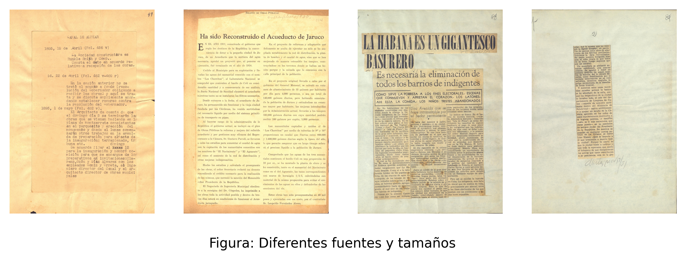

El color del papel o color de fondo de las fotografías puede variar entre blanco a tonalidades de amarillo, incluso rojizas en algunos casos. Los textos en su mayoría son mecanografiados, aunque existen tachaduras y escritos a manos en algunos casos, como suelen ser fechas, firmas y anotaciones marginales, número interno de la página, entre otros. El texto está en español, aunque en ligeros casos puede contener palabras en otros idiomas, pero del alfabeto latino.

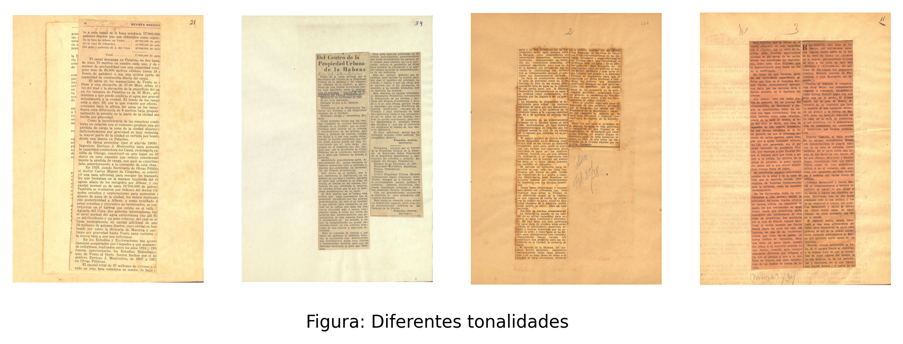

Las fotografías pueden ser imágenes de una página completa, fragmentos de una página, pueden estar en una columna de texto, u horizontales a lo largo de la página. Las imágenes pueden ser dibujos, gráficos, mapas, o fotografías de personas, pueden estar rodeadas de algún contorno o marco que las delimite. En su mayoría las imágenes son con forma rectangular, aunque existen casos de imágenes con formas irregulares.

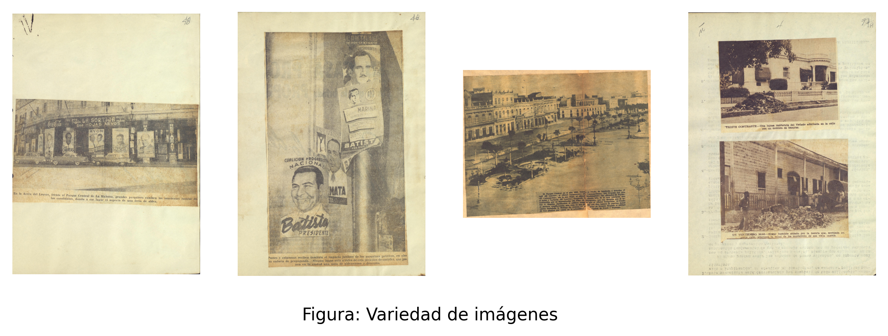

Debido a que estas fotografías son de documentos antiguos, pueden contener manchas, dobleces, arrugas, desgaste del papel, y otros daños que afectan la calidad de la imagen. En algunos casos las fotografías pueden estar rotadas en un ángulo, pero siempre con una perspectiva frontal. Y es requisito del problema recuperar las imágenes en el ángulo correcto, para evitar que el investigador tenga que rotar la imagen o recortarla para la digitalización.

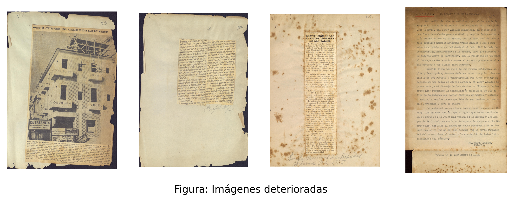

El conjunto de datos pesa alrededor de 60GB en total, es de acceso público y puede ser descargado desde las Paginas oficiales de la oficina del historiador de la Habana. [https://repositoriodigital.ohc.cu/s/repositoriodigital/item-set/46268](https://repositoriodigital.ohc.cu/s/repositoriodigital/item-set/46268)

## Propuesta de solución

El problema de correspondencia entre imágenes y texto en documentos históricos presenta desafíos en la localización de contenido dentro de las fotografías y su posterior asociación con la información correcta. Para abordar esta problemática, hemos dividido nuestro enfoque en dos subproblemas principales: (1) Detección y extracción de texto y (2) Asociación de imágenes con texto.

### Detención de Imágenes y Textos en las fotografías

Para identificar imágenes y textos en las fotografías decidimos utilizar el modelo de Deep Learning YOLO, en su version mas reciente(YOLOv11). YOLO posee la variante OBB(oriented bounding boxes - cuadros delimitadores orientados) que permite cumplir con el requisito de identificar las imágenes según el angulo que ha sido tomada la fotografía; además rotar el texto a su alineación original facilita la integración con los OCR. Permite identificar varias clases diferentes en un mismo análisis, lo que nos facilita no tener dos modelos para identificar texto e imágenes por separado. El modelo puede refinarse en el futuro añadiendo nuevas fotografías para mejorar las métricas en los escenarios que sean de interés, de igual manera nos permite usar modelos pre entrenados y mejorarlos con nuestros datos. YOLO al ser un modelo de deep learning tiene la capacidad de reconocer patrones complejos en las fotografías, como textos deformados, fondos borrosos o imágenes movidas. YOLO utiliza técnicas de multi-escala (ej: FPN - Feature Pyramid Networks) para detectar objetos pequeños, lo cual puede ser util para columnas estrechas y pie de fotos. Además YOLO tiene varios modelos que permiten ajustar la precisión y velocidad del modelo, en nuestro caso usamos el modelo Nano que permite procesar grandes volúmenes de imágenes en un tiempo relativamente rápido sin tener que usar gpu costosas, lo cual es ideal para el desarrollo de un software con los pesos exportados.

Para el entrenamiento etiquetando 4 clases principales:

- Texto: Todo tipo de textos mecanografiados, encabezados siempre manteniendo su dirección original según el flujo de la página.
- Imagen: Todo tipo de imágenes, dibujos, gráficos, mapas, fotografías, entre otros.
- Escrito a mano: Anotaciones marginales, firmas, fechas, números internos de la página, entre otros.
- Caption: Textos que acompañan a las imágenes, como títulos, subtítulos, pies de foto. Esta clase lo hicimos como extra para poder asociar images con sus descripciones. Los captions usualmente son textos cortos y están cerca de las imágenes, en negrita o en cursiva. Para mejorar la selección de captions, decidimos llevar el bounding box desde el texto tomando un fragmento pequeño de la imagen.

La primera iteración la hicimos con 893 fotografías teniendo etiquetados 2903 textos, 341 imágenes, 223 captions, y 980 escritos a mano. Realizando ajuste de hiperparametros y posteriormente entrenando el modelo obtuvimos las siguientes métricas:

#### Primer Entrenamiento - Métricas

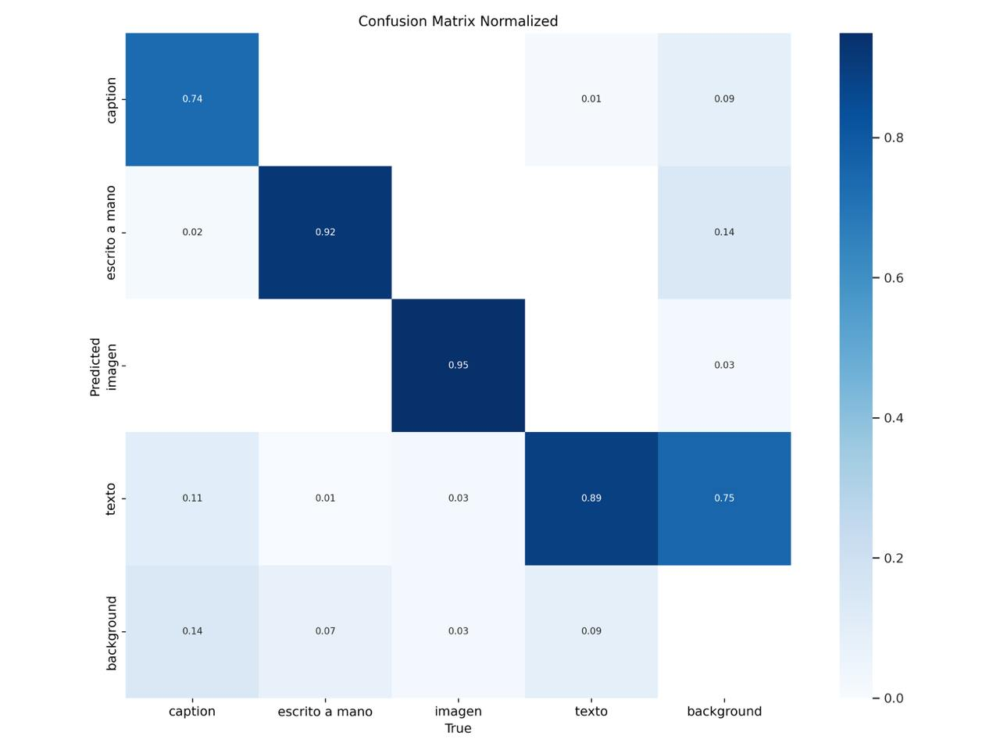

Como se puede observar en la matriz de confusion se detectaron partes del fondo de las fotografías como texto, esto se debe a que existen fotografías que tienen marcados los textos de el otro lado de la página.

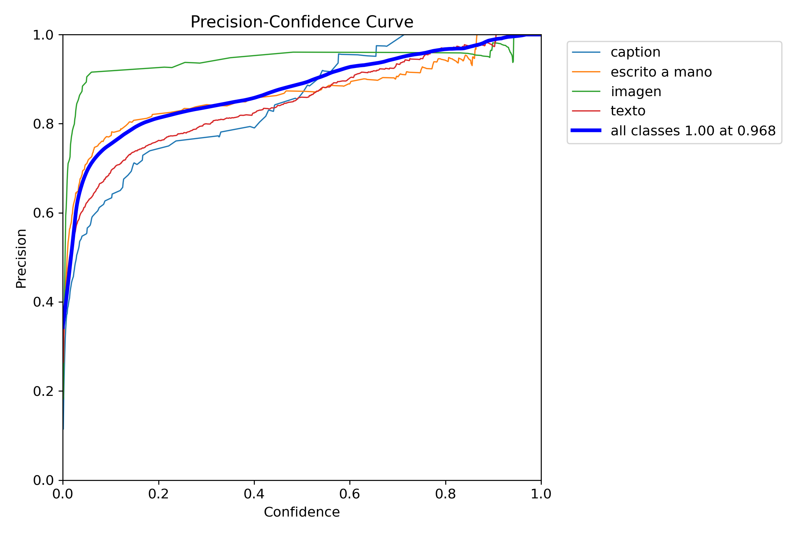

La Precision-Confidence Curve muestra cómo la precisión del modelo varía en función de los niveles de confianza. Se observa que la clase "imagen" alcanza una precisión alta incluso en niveles bajos de confianza, mientras que la clase "caption" presenta un menor rendimiento inicial, indicando mayor presencia de falsos positivos. La clase "texto" no logra mantener una precisión alta en niveles de confianza bajos, lo que sugiere que el modelo tiene dificultades para identificar correctamente los textos en las fotografías. En general se nota falta de consistencia en las clases de "caption" y "escrito a mano", que se puede deber al desbalance de los datos etiquetados.

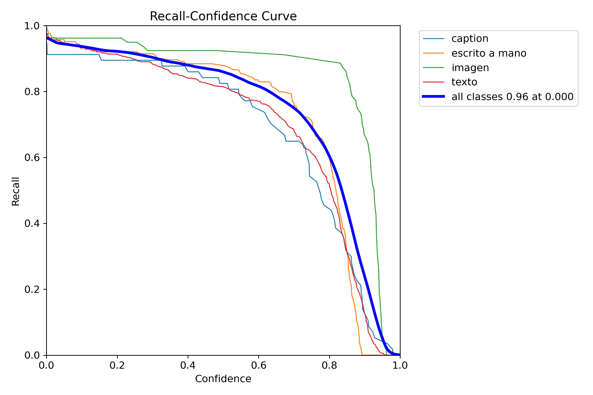

En la curva de recall se puede observar que la clase "imagen" es la que tiene el mejor recall, a pesar de ser una clase con pocos datos etiquetados, logra mantener un buen recall, lo que puede sugerir que existen patrones muy notables y consistentes que identifican a las imágenes o que este alto recall se debe a la escasez de datos en el entrenamiento. Y por otro lado los textos, que son la clase con mayor cantidad de datos etiquetados, no logra mantener un recall alto, lo que puede sugerir que la calidad de los datos o la variabilidad de los textos afecta el rendimiento del modelo.

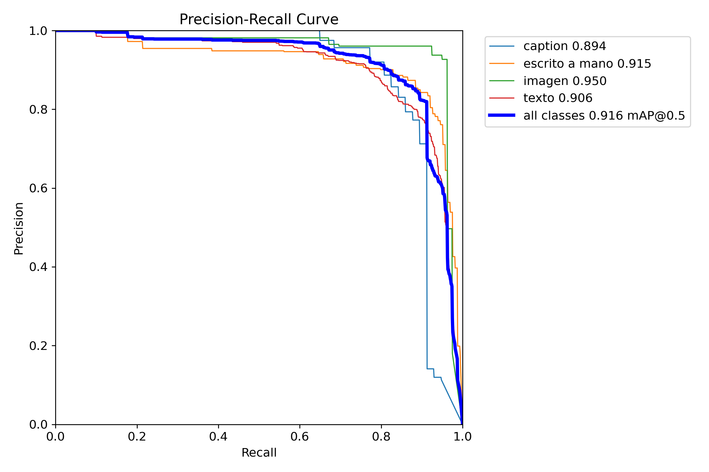

Finalmente la tabla de Precision-Recall muestra que la clase "imagen" es la que tiene el mejor rendimiento, seguida por la clase "escrito a mano", mientras que la clase "texto" y "caption" presentan un rendimiento inferior. Y se nota como la clase caption tiene un rendimiento muy bajo en comparación con las otras clases, lo que sugiere que el modelo tiene dificultades para identificar correctamente los captions en las fotografías.

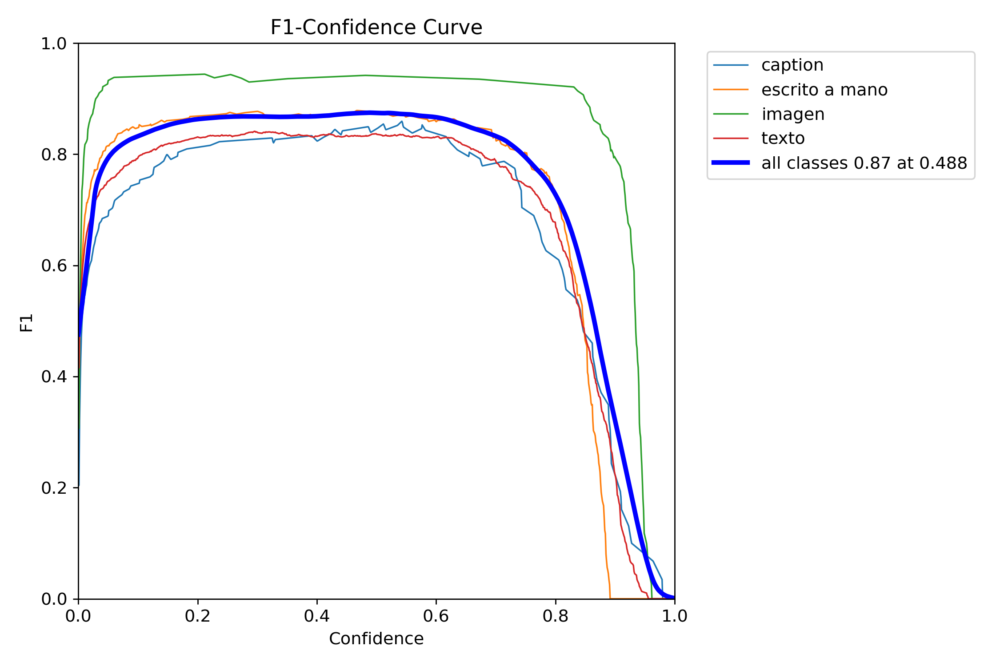

Finalmente la gráfica F1 para cada una de las clases. Muestra el balance entre la precisión y el recall, y se observa que la clase "imagen" es la que tiene el mejor rendimiento, seguida por la clase "escrito a mano", mientras que la clase "texto" y "caption" presentan un rendimiento inferior.

#### Segundo Entrenamiento - Aumento de datos - Métricas

Para mejorar la cantidad de datos etiquetados, decidimos hacer un segundo etiquetado de las fotografías con aquellas que el modelo no identificó, obtuvo bajo nivel de confianza o tuvieron resultados erróneos con respecto al angulo y tamaño, obteniendo un total de 1221 fotografías etiquetadas.

De las 1221 fotografías al final etiquetadas obtuvimos: 3492 textos, 794 imágenes, 483 captions y 981 escritos a mano.
Realizamos un segundo ajuste de hiperparametros y entrenamos el modelo nuevamente, obteniendo las siguientes métricas:

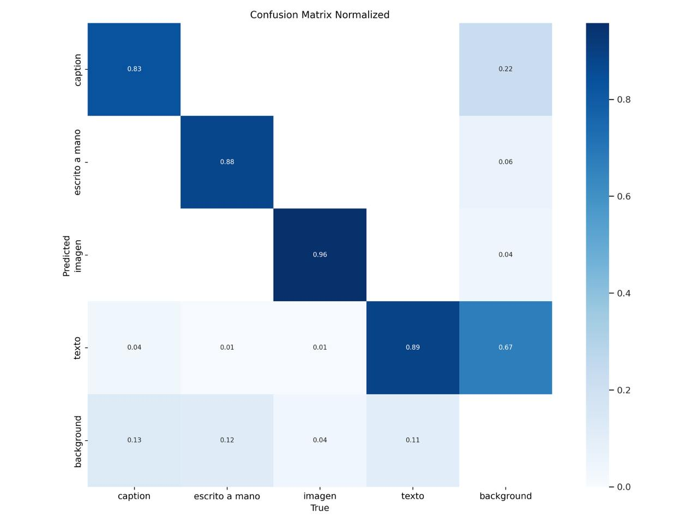

Tras los cambios realizados obtuvimos una mejora en los verdaderos positivos en todas las clases, y en la clase texto logramos disminuir la clasificación errónea de fondo como texto.

.png>)

Con el aumento de los datos etiquetados en cada clase obtenemos un poco mas de heteregeonidad en los reultados permitiendo analizar mejor las graficas. Sin embargo salen a relucir errores que tenian menos visibilidad porque estaban relacionados con la deficiencia de datos entre las clases.

.png>)

En la gráfica del recall se nota como bajan un poco la inclinación de las clases, sin embargo la clase de imágenes para altas confiabilidades se mantiene alto el recall lo que implica robustez en el modelo.

.png>)

En la gráfica de precision recall se muestra un mejor análisis de los datos luego del aumento del dataset, permitiendo observar las caídas bruscas a medida que aumenta el recall como un aspecto
negativo.

.png>)

Como mejora al igual que en los gráficos anteriores se puede observar la separación entre las diferentes clases luego del aumento del dataset.

#### Experimento preprocesando la imágenes antes del entrenamiento:

Como mejora al modelo durante el primer entrenamiento de 1221 fotografías se probaron técnicas de preprocesamiento de imágenes. Los resultados más significativos los obtuvimos aplicando escala de grises, lo cual es una aspecto a favor ya que disminuye la dimensionalidad de los datos, ademas de no ser relevante para las clases que tenemos que clasificar en el modelo. Se aplico CLAHE (Contrast Limited Adaptive Histogram Equalization) para resaltar el texto, bordes, y disminuir el cambio de iluminación en las distintas fotografías.Se probo también reducción de ruido con GaussianBlur, y
suavizado con BilateralFilter para preservar los bordes y mejorar la nitidez de la imagen.

Ejemplo de preprocesamiento:
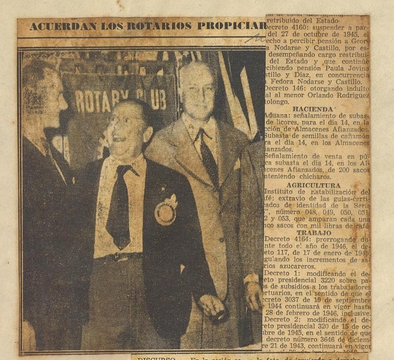

Cambio de contraste y escala de grises:

Para el ajuste de los hiperparametros solo se pudieron realizar 10 iteraciones con diferentes configuraciones, los mejores resultados usando este preprocesamiento fueron:

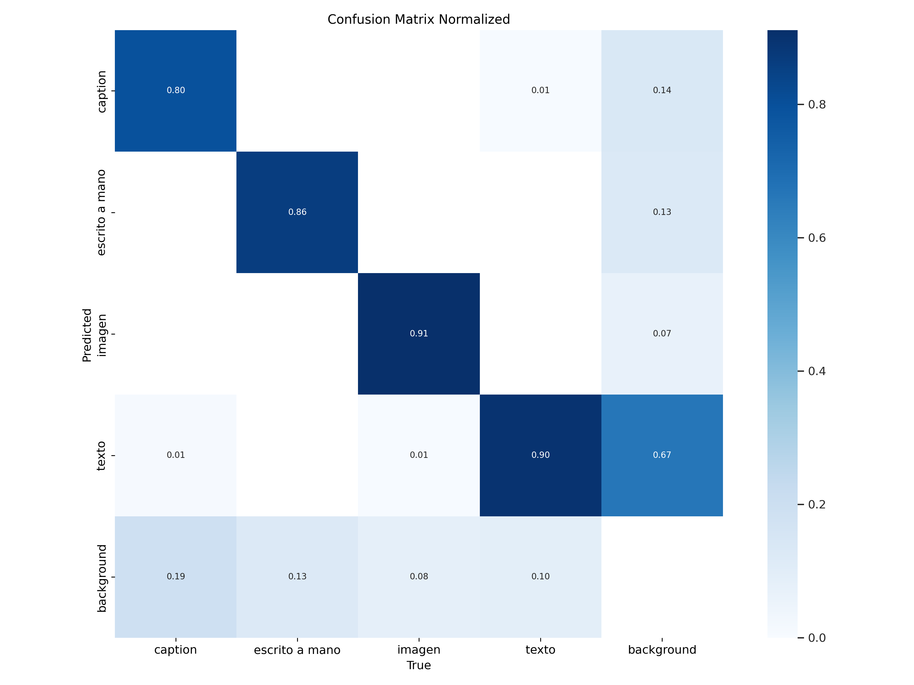

En general no hubo cambios significativos en los datos de la matriz de confusion.

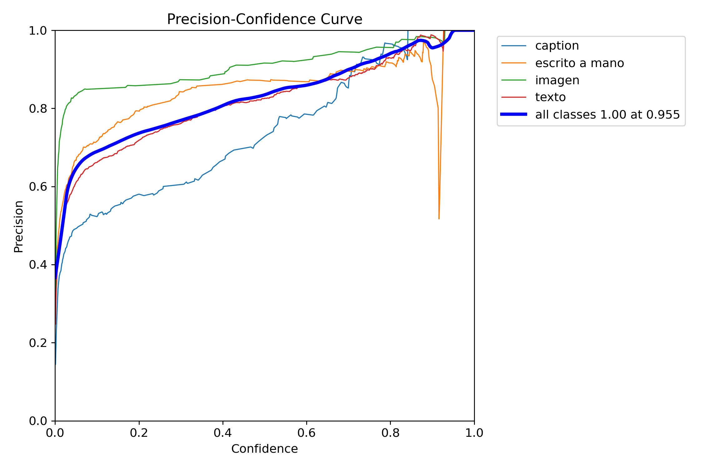

En la curva de precision para mayor confiabilidad se convergen mejor los resultados que en los experimentos anteriores.

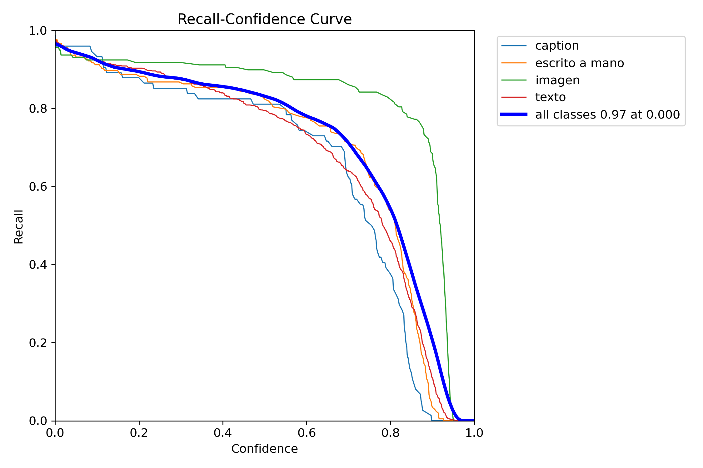

El mejor resultado que hemos obtenido entre los experimentos anteriores, logramos mejorar las métricas de las clases en general, sobretodo del texto que es una de las más importantes en nuestro problema.

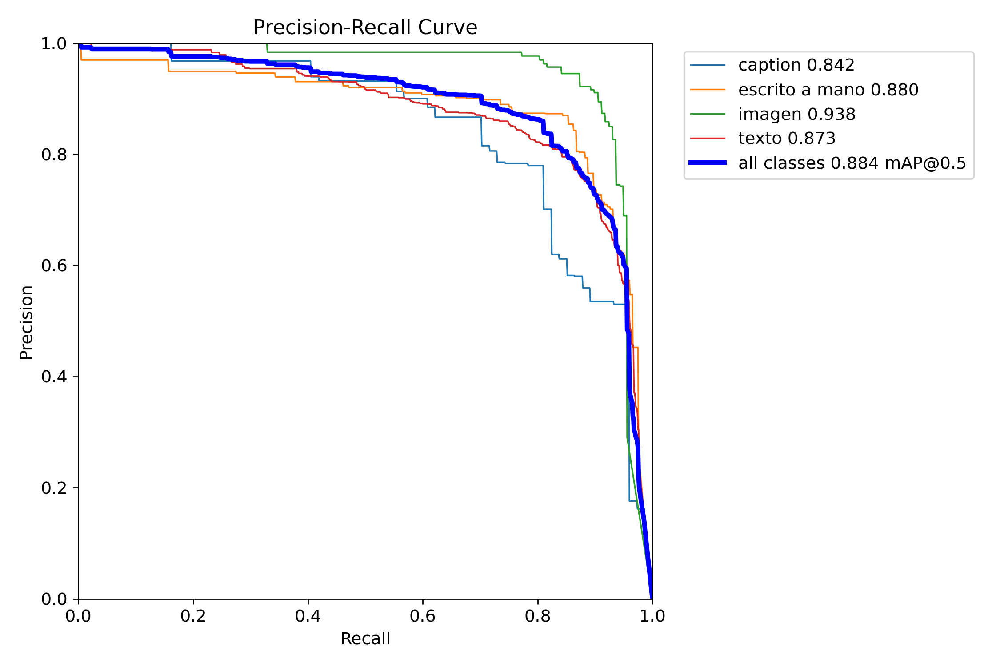

Al igual que con la precision se nota mejor la convergencia de las clasificaciones de las clases.

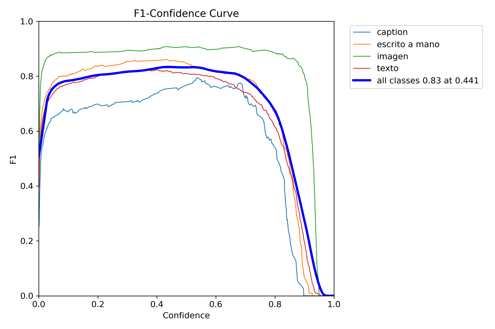

Mejoro los resultados con respecto a los experimentos a medida que aumenta la confiabilidad.

#### Conclusiones y Propuestas a seguir

Concluimos que el mejor modelo entrenado fue con preprocesamiento de las fotografías, por lo cual recomendamos realizar un ajustes de hiperparametros con más iteraciones para logar una mejor configuración. Además recomendamos probar con otras técnicas de preprocesamiento como las descritas en [https://tolstoy.ai/tolstoy-wall-st-journal-transcribe-newspapers/](https://tolstoy.ai/tolstoy-wall-st-journal-transcribe-newspapers/). También proponemos probar con otros modelos de YOLO
que requieren mayor capacidad de computo como YOLOv11 OBB M, y analizar que tanto mejorar los resultados.
Proponemos mejorar y regularizar el dataset con mayor equilibrio de clases para evitar sesgos en el modelo y llegar a mejores resultados.

### Asociación de imágenes y texto

**_ Preprocesamiento _**

**_ TESSERACT _**

**_ AQUI HABLAR DE LAS METRICAS _** CER Y JACKARD

**_ post procesamiento _**

**_ CLIP _**

**_ AQUÍ HABLAR DE LOS RESULTADOS Y ANÁLISIS CRITICO DE LOS RESULTADOS _**

### Referencias

[1] Li, H., & Zhang, N. (2024). Computer Vision Models for Image Analysis in Advertising Research. Journal of Advertising, 53(5), 771–790. https://doi.org/10.1080/00913367.2024.2407644

[2] Molly Brandt Skelbye, Dana Dannélls. OCR Processing of Swedish Historical Newspapers Using Deep Hybrid CNN-LSTM Networks 2021 .https://doi.org/10.26615/978-954-452-072-4_023

[3] Vu, H.-N., Nguyen, H.-D., & Tran, M.-T. (2022). Re-matching Images and News Using CLIP Pretrained Model. CEUR Workshop Proceedings. Recuperado de https://arxiv.org/abs/2103.00020.

[4] K. M. Yindumathi, S. S. Chaudhari and R. Aparna, "Analysis of Image Classification for Text Extraction from Bills and Invoices," 2020 11th International Conference on Computing, Communication and Networking Technologies (ICCCNT), Kharagpur, India, 2020, pp. 1-6, doi: 10.1109/ICCCNT49239.2020.9225564.

[5] https://tolstoy.ai/tolstoy-wall-st-journal-transcribe-newspapers/
